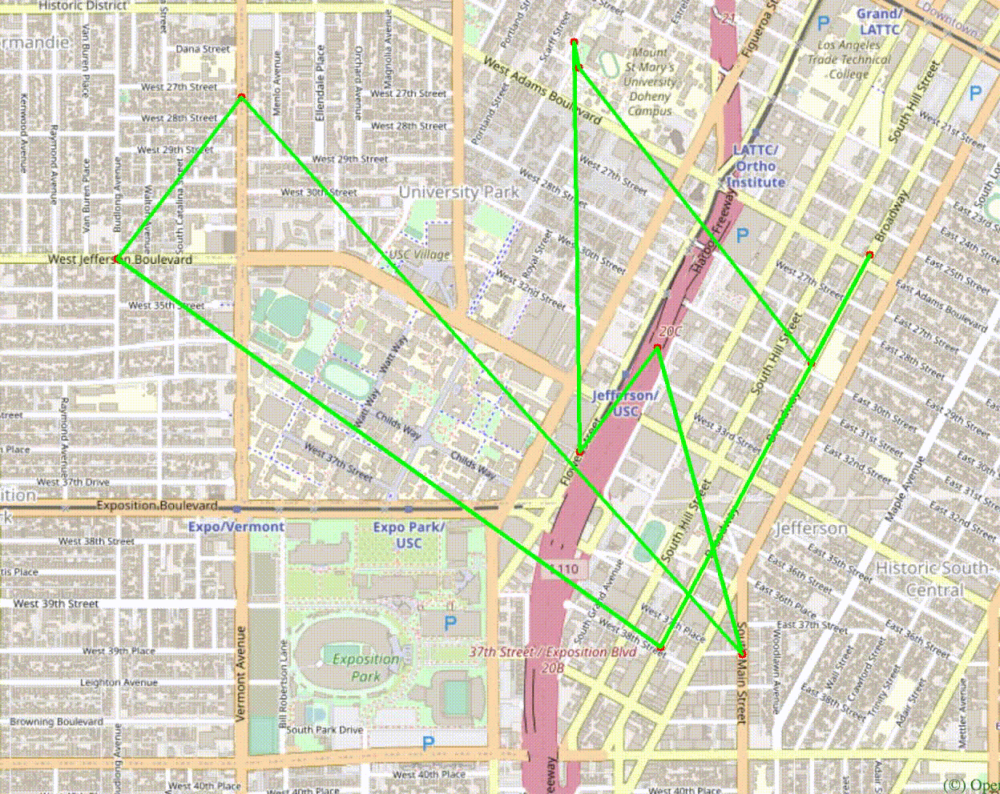

# EE538 Final Project - Fall 2021 - TrojanMap 
  By Anushka Poojary,
     Sai Madhav Vedala

## Deadline: 

Video Presentation: Friday, December 3 by 2 pm

Code submission: Monday, December 5 by 23:59 pm

## TrojanMap

This project focuses on using data structures in C++ and implementing various graph algorithms to build a map application.

<p align="center"></p>

- Please clone the repository, look through [README.md](README.md) and fill up functions to finish in the project.
- Please make sure that your code can run `bazel run/test`.
- In this project, you will need to fill up [trojanmap.cc](src/lib/trojanmap.cc) and add unit tests in the `tests` directory.

---

## The data Structure

Each point on the map is represented by the class **Node** shown below and defined in [trojanmap.h](src/lib/trojanmap.h).

```cpp
class Node {
  public:
    std::string id;    // A unique id assign to each point
    double lat;        // Latitude
    double lon;        // Longitude
    std::string name;  // Name of the location. E.g. "Bank of America".
    std::vector<std::string>
        neighbors;  // List of the ids of all neighbor points.
};

```

---

## Prerequisites

### OpenCV Installation

For visualization, we use OpenCV library. You will use this library as a black box and don't need to worry about the graphic details.

Use the following commands to install OpenCV.

```shell
$ cd 2021Fall_TrojanMap
$ git clone https://github.com/opencv/opencv.git
```

### Other library Installations

For Ubuntu:
```shell
$ sudo apt-get install cmake libgtk2.0-dev pkg-config
$ sudo apt install libcanberra-gtk-module libcanberra-gtk3-module
$ sudo apt-get install libncurses5-dev libncursesw5-dev
$ cp ubuntu/* ./
```

For MacOS:
```shell
$ brew install cmake
$ brew install ncurses
```

Next, type the following, but make sure that you set the **path_to_install_folder** to be the absolute path to the install folder under opencv.

```shell
$ cd opencv/
$ mkdir build install
$ cd build
$ cmake -D CMAKE_INSTALL_PREFIX=**path_to_install_folder**\
 -D BUILD_LIST=core,highgui,imgcodecs,imgproc,videoio\
 -D WITH_TBB=ON -D WITH_OPENMP=ON -D WITH_IPP=ON\
 -D CMAKE_BUILD_TYPE=RELEASE -D BUILD_EXAMPLES=OFF\
 -D WITH_NVCUVID=ON\
 -D WITH_CUDA=ON\
 -D BUILD_DOCS=OFF\
 -D BUILD_PERF_TESTS=OFF\
 -D BUILD_TESTS=OFF\
 -D WITH_CSTRIPES=ON\
 -D WITH_OPENCL=ON ..
$ make install
```

For example, if cloned this repo under "/Users/ari/github/TrojanMap", you should type:

```shell
$ cd opencv/
$ mkdir build install
$ cd build
$ cmake -D CMAKE_INSTALL_PREFIX=/Users/ari/github/TrojanMap/opencv/install\
 -D BUILD_LIST=core,highgui,imgcodecs,imgproc,videoio\
 -D WITH_TBB=ON -D WITH_OPENMP=ON -D WITH_IPP=ON\
 -D CMAKE_BUILD_TYPE=RELEASE -D BUILD_EXAMPLES=OFF\
 -D WITH_NVCUVID=ON\
 -D WITH_CUDA=ON\
 -D BUILD_DOCS=OFF\
 -D BUILD_PERF_TESTS=OFF\
 -D BUILD_TESTS=OFF\
 -D WITH_CSTRIPES=ON\
 -D WITH_OPENCL=ON ..
$ make install
```

---

## Run the program

Please run:

```shell
$ bazel run src/main:main
```

If everything is correct, this menu will show up.

```shell
Torjan Map
**************************************************************
* Select the function you want to execute.                    
* 1. Autocomplete                                             
* 2. Find the position                                        
* 3. CalculateShortestPath                                    
* 4. Travelling salesman problem                              
* 5. Cycle Detection                                          
* 6. Topological Sort                                         
* 7. Find K Closest Points                                    
* 8. Exit                                                     
**************************************************************
Please select 1 - 8:
```

## Test the program

We created some tests for you to test your program, please run
```shell
$ bazel test tests:trojanmap_test
```

Please add you test in the [trojanmap_test_student.cc](tests/trojanmap_test_student.cc) and run

```shell
$ bazel test tests:trojanmap_test_student
```

## First task is to implement a function for each menu item

## Step 1: Autocomplete the location name

```c++
std::vector<std::string> Autocomplete(std::string name);
```

We consider the names of nodes as the locations. Implement a method to type the partial name of the location and return a list of possible locations with partial name as prefix. Please treat uppercase and lower case as the same character.

Example:

Input: "ch" \
Output: ["ChickfilA", "Chipotle Mexican Grill"]

Input: "ta" \
Output: ["Target", "Tap Two Blue"]

```shell
1
**************************************************************
* 1. Autocomplete                                             
**************************************************************

Please input a partial location:ch
*************************Results******************************
ChickfilA
Chipotle Mexican Grill
**************************************************************
Time taken by function: 1904 microseconds
```

## Step 2: Find the place's Coordinates in the Map

```c++
std::pair<double, double> GetPosition(std::string name);
```

Given a location name, return the latitude and longitude. There are no duplicated location names. You should mark the given locations on the map. If the location does not exist, return (-1, -1).

Example:

Input: "ChickfilA" \
Output: (34.0167334, -118.2825307)

Input: "Ralphs" \
Output: (34.0317653, -118.2908339)

Input: "Target" \
Output: (34.0257016, -118.2843512)

```shell
2
**************************************************************
* 2. Find the position                                        
**************************************************************

Please input a location:Target
*************************Results******************************
Latitude: 34.0257 Longitude: -118.284
**************************************************************
Time taken by function: 1215 microseconds
```

<p align="center"></p>

## Step 3: CalculateShortestPath between two places

```c++
std::vector<std::string> CalculateShortestPath_Dijkstra(std::string &location1_name,
                                               std::string &location2_name);
std::vector<std::string> CalculateShortestPath_Bellman_Ford(std::string &location1_name,
                                               std::string &location2_name);
```

Given 2 locations A and B, find the best route from A to B. The distance between 2 points is the euclidean distance using latitude and longitude. You should use both Dijkstra algorithm and Bellman-Ford algorithm. Compare the time for the different methods. Show the routes on the map. If there is no path, please return empty vector.

Please report and compare the time spent by these 2 algorithms.

Example:

Input: "Ralphs", "ChickfilA" \
Output: ["2578244375", "5559640911", "6787470571", "6808093910", "6808093913", "6808093919", "6816831441",
      "6813405269", "6816193784", "6389467806", "6816193783", "123178876", "2613117895", "122719259",
      "2613117861", "6817230316", "3642819026", "6817230310", "7811699597", "5565967545", "123318572",
      "6813405206", "6813379482", "544672028", "21306059", "6813379476", "6818390140", "63068610", 
      "6818390143", "7434941012", "4015423966", "5690152766", "6813379440", "6813379466", "21306060",
      "6813379469", "6813379427", "123005255", "6807200376", "6807200380", "6813379451", "6813379463",
      "123327639", "6813379460", "4141790922", "4015423963", "1286136447", "1286136422", "4015423962",
      "6813379494", "63068643", "6813379496", "123241977", "4015372479", "4015372477", "1732243576",
      "6813379548", "4015372476", "4015372474", "4015372468", "4015372463", "6819179749", "1732243544",
      "6813405275", "348121996", "348121864", "6813405280", "1472141024", "6813411590", "216155217", 
      "6813411589", "1837212103", "1837212101", "6820935911", "4547476733"]

```shell
3
**************************************************************
* 3. CalculateShortestPath
**************************************************************

Please input the start location:Ralphs
Please input the destination:ChickfilA
*************************Results******************************
The distance of the path is:1.53852 miles
**************************************************************
Time taken by function: 45149 microseconds
```

<p align="center"></p>

## Step 4: The Traveling Trojan Problem (AKA Traveling Salesman!)

In this section, we assume that a complete graph is given to you. That means each node is a neighbor of all other nodes.
Given a vector of location ids, assume every location can reach all other locations in the vector (i.e. assume that the vector of location ids is a complete graph).
Find the shortest route that covers all the locations exactly once and goes back to the start point. 

You will need to return the progress to get the shortest route which will then be converted to an animation.  

We will use the following algorithms:

- Backtracking
```c++
std::pair<double, std::vector<std::vector<std::string>>> TravellingTrojan(
      std::vector<std::string> &location_ids);
```
- [2-opt Heuristic](https://en.wikipedia.org/wiki/2-opt). Also see [this paper](http://cs.indstate.edu/~zeeshan/aman.pdf)
```c++
std::pair<double, std::vector<std::vector<std::string>>> TravellingTrojan_2opt(
      std::vector<std::string> &location_ids);
```

Please report and compare the time spent by these 2 algorithms. 2-opt algorithm may not get the optimal solution. Please show how far your solution is from the optimal solution.

Show the routes on the map. For each intermediate solution, create a new plot. Your final video presentation should include the changes to your solution.

We will randomly select N points in the map and run your program.

```shell
4
**************************************************************
* 4. Travelling salesman problem                              
**************************************************************

In this task, we will select N random points on the map and you need to find the path to travel these points and back to the start point.

Please input the number of the places:10
Calculating ...
*************************Results******************************
The distance of the path is:4.70299 miles
**************************************************************
You could find your animation at src/lib/output.avi.          
Time taken by function: 152517394 microseconds
```

<p align="center"></p>

<p align="center"></p>

## Step 5: Cycle Detection

```c++
bool CycleDetection(std::vector<double> &square);
```

In this section, we use a square-shaped subgraph of the original graph by using four coordinates stored in ```std::vector<double> square```, which follows the order of left, right, upper, and lower bounds. 

Then try to determine if there is a cycle path in the that subgraph. If it does, return true and report that path on the map. Otherwise return false.

Example 1:
```shell
Input: square = {-118.299, -118.264, 34.032, 34.011}
Output: true
```
Here we use the whole original graph as our subgraph. 
<p align="center"></p>

Example 2:
```shell
Input: square = {-118.290919, -118.282911, 34.02235, 34.019675}
Output: false
```
Here we use a square area inside USC campus as our subgraph
<p align="center"></p>

Note: You could use the function below to visualize the subgraph. 

```c++
/**
 * PlotPoints: Given a vector of location ids draws the points on the map (no path).
 * 
 * @param  {std::vector<std::string>} location_ids : points inside square
 * @param  {std::vector<double>} square : boundary
 */
void TrojanMap::PlotPointsandEdges(std::vector<std::string> &location_ids, std::vector<double> &square)
```
```shell
5
**************************************************************
* 5. Cycle Detection                                          
**************************************************************

Please input the left bound longitude(between -118.299 and -118.264):-118.299
Please input the right bound longitude(between -118.299 and -118.264):-118.264
Please input the upper bound latitude(between 34.011 and 34.032):34.032
Please input the lower bound latitude(between 34.011 and 34.032):34.011
*************************Results******************************
there exists cycle in the subgraph 
**************************************************************
Time taken by function: 273734 microseconds

5
**************************************************************
* 5. Cycle Detection                                          
**************************************************************

Please input the left bound longitude(between -118.299 and -118.264):-118.290919
Please input the right bound longitude(between -118.299 and -118.264):-118.282911
Please input the upper bound latitude(between 34.011 and 34.032):34.02235
Please input the lower bound latitude(between 34.011 and 34.032):34.019675
*************************Results******************************
there exist no cycle in the subgraph 
**************************************************************
Time taken by function: 290371 microseconds
```
## Step 6: Topological Sort

```c++
std::vector<std::string> DeliveringTrojan(std::vector<std::string> &location_names,
                                            std::vector<std::vector<std::string>> &dependencies);
```

Tommy Trojan got a part-time job from TrojanEats, for which he needs to pick up and deliver food from local restaurants to various location near the campus. Tommy needs to visit a few different location near the campus with certain order, since there are some constraints. For example, he must first get the food from the restaurant before arriving at the delivery point. 

The TrojanEats app will have some instructions about these constraints. So, Tommy asks you to help him figure out the feasible route!

Here we will give you a vector of location names that Tommy needs to visit, and also some dependencies between those locations.


For example, 

```shell
Input: 
location_names = {"Cardinal Gardens", "Coffee Bean1", "CVS"}
dependencies = {{"Cardinal Gardens","Coffee Bean1"}, {"Cardinal Gardens","CVS"}, {"Coffee Bean1","CVS"}}
```

Here, ```{"Cardinal Gardens","Coffee Bean1"}``` means
that Tommy must go to `Cardinal Gardens` prior to `Coffee Bean1`.

Your output should be:
```shell
Output: Cardinal Gardens -> Coffee Bean1 -> CVS
```
Also, we provide ```PlotPointsOrder``` function that can visualize the results on the map. It will plot each location name and also some arrowed lines to demonstrate a feasible route.

If no feasible route exists, you could simply return an empty vector.

Hint:
- You also need to finish ```ReadLocationsFromCSVFile``` and ```ReadDependenciesFromCSVFile``` functions, so you could read and parse data from you own CSV files. We also give two sample CSV files under ```input``` folder, which could be a reference. 
- When it asks you filenames, you need to give the absolute path.
- If you do not have ```ReadLocationsFromCSVFile``` and ```ReadDependenciesFromCSVFile``` functions ready yet, you can just press enter when it asks you filenames. It will call the default locations and dependencies.
- The locations are actually nodes, and the dependencies could be directed edges. You may want to first construct a DAG and then implement topological sort algorithm to get the route.

```shell
6
*************************Results******************************
Topological Sorting Results:
Cardinal Gardens
Coffee Bean1
CVS
**************************************************************
Time taken by function: 43 microseconds
```
<p align="center"></p>

In the user interface, we read the locations and dependencies from `topologicalsort_dependencies.csv` and `topologicalsort_locations.csv` to modify your input there.

## Step 7: Find K closest points

Given a location name and a integer k , find the k closest locations with name on the map and return a vector of string ids. 

We will use the following algorithms:

- Backtracking
```c++
std::vector<std::string> FindKClosestPoints(std::string name, int k);
```

Please report and compare the time spent by this algorithm and show the points on the map.

```shell
**************************************************************
* 7. Find K Closest Points                                    
**************************************************************

7
**************************************************************
* 7. Find K Closest Points                                    
**************************************************************

Please input the locations:Ralphs
Please input k:5
*************************Results******************************
Find K Closest Points Results:
1 St Agnes Church
2 Saint Agnes Elementary School
3 Warning Skate Shop
4 Menlo AvenueWest Twentyninth Street Historic District
5 Vermont Elementary School
**************************************************************
Time taken by function: 1975 microseconds
```

<p align="center"></p>


## Reporting Runtime:
For each menu item, your program should show the time it took to finish each task.

Please make sure to provide various examples when you report the runtime. For example for topological sort, show an example with few nodes and another example with 10 or more nodes. The idea is to see how your runtime grows as input size grows.

## Runtime Comparison
For shortest path algorithms, you should compare solving the same problem with different algorithms (Dijkstra and Bellman-Ford). Please show the results on at least 10 different examples.

Similarly for TSP problem, please provide various examples that show the runtime comparison. In particular, you should show at what point using the exhaustive search is not practical and compare the same input with the heuristic implementation.


## Report and Rubrics:

Your final project should be checked into Github. The README of your project is your report. 

### Report:

Your README file should include two sections:

1. High-level overview of your design (Use diagrams and pictures for your data structures).
2. Detailed description of each function and its time complexity.
3. Time spent for each function.
4. Discussion, conclusion, and lessons learned.

### Rubrics:

1. Implementation of auto complete: 5 points.
2. Implementation of GetPosition: 5 points.
3. Implementation of shortest path: 15 points.
   1. Bellman-Ford implementation
   2. Dijkstra implementation
   3. Plot two paths, and measure and report time spent by two algorithms.
4. Implementation of Travelling Trojan: 
   1. Brute Force: 10 points.
   2. 2-opt: 10 points.
   3. Animated plot: 5 points.
4. Implement of Cycle detection: 10 points.
   1. Boolean value and draw the cycle if there exists one.
5. Topological Sort: 10 points.
   1. Check whether there exist a topological sort or not
   2. Return the correct order and plot those point on the map
6. Creating reasonable unit tests: 10 points.
   1. Three different unit tests for each item.
7. Find K closest points: 10 points.
   1. Return the correct ids and draw the points.
8. Video presentation and report: 10 points.

9. **Extra credit items**: Maximum of 20 points:
   1. [3-opt](http://cs.indstate.edu/~zeeshan/aman.pdf): 10 points.
   2. [Genetic algorithm](https://www.geeksforgeeks.org/traveling-salesman-problem-using-genetic-algorithm/) implementation for Travelling Trojan: 10 points
   3. Create dynamic and animated UI using [ncurses](https://en.wikipedia.org/wiki/Ncurses): 10 points
      - You could check https://github.com/ourarash/ncurses_bazel
      - Please develope your own UI.
      - Example
      - Accurate measurement of your algorithm runtime using Google Benchmark while sweeping the input size and providing a diagram of how the runtime grows based on the input size.
<p align="center"></p>
   Note: For Ubuntu, you main need to use the following command to prevent errors.
   
   ```shell
   $ bazel run --cxxopt='-std=c++17' src/main:main
   ```
   
   ## FINAL REPORT
   
   ## PART 1 : AutoComplete
- Return a list of possible locations with partial name as prefix
- Input: Partial name prefix of a location on the map
- Output: List of locations matching the prefix
- Time Complexity: O(N)
- EXAMPLE 1:
<p align="center"></p>

  EXAMPLE 2:
<p align="center"></p>

   ## PART 2 : GetPosition
- Returns the coordinates of a location in the map
- Input: Name of the location
- Output: Latitude and Longitude of the location
          Plots the location on the map
- Time Complexity: O(N)

EXAMPLE 1:  
<p align="center"></p>
<p align="center"></p>

EXAMPLE 2:
<p align="center"></p>
<p align="center"></p>

   ## PART 3 : ShortestPath - Dijkstra
- Returns the shortest path between two locations given their names.
- Used priority queue to reduce time complexity from O(N^2) to O(NlogN)
- Input: Names of the two locations
- Output: List of locations in the shortest path and the distance of the shortest path
- Time Complexity: O(NlogN)

  EXAMPLE 1: 
 <p align="center"></p>
 <p align="center"></p>
  
  EXAMPLE 2:
 <p align="center"></p>
 <p align="center"></p>

  EXAMPLE 3:
<p align="center"></p>
<p align="center"></p>

<p align="center"></p>

  
  ShortestPath - Bellman-Ford
- Returns the shortest path between two locations given their names.
- Input: Names of the two locations
- Output: Distance of the shortest path
- Time Complexity: O(MN)

EXAMPLE 1 
<p align="center"></p>
<p align="center"></p>
  
  EXAMPLE 2:
<p align="center"></p>
<p align="center"></p>

  EXAMPLE 3:
<p align="center"></p>
<p align="center"></p>
<p align="center"></p>

We observe that Dijkstra implementation is way faster than Bellman-Ford. This is seen in the below table depicting run-times.


   
   ## PART 4 : TRAVELING TROJAN
   
  TRAVELING TROJAN : BRUTE FORCE APPROACH 
- Returns the shortest route that covers all the locations given in a list exactly once and goes back to the start point
- Input: Number of locations
- Output: Distance of the path
  We assume a complete graph is given i.e.  each node is a neighbor of all other nodes.
  We permutate through the input number of random locations to find the most optimal path.
- Time Complexity: O(N!)
  ## EXAMPLE 1:
   <p align="center"></p>
   <p align="center"></p>
  
  ## EXAMPLE 2:
   <p align="center"></p>
   <p align="center"></p>
  
  ## EXAMPLE 3: 
   <p align="center"></p>
   <p align="center"></p>
  
  TRAVELING TROJAN : 2 - OPT APPROACH 
- Returns the shortest route that covers all the locations given in a list exactly once and goes back to the start point
- Input: Number of locations
- Output: Distance of the path
  Works on the principle of choosing 2 arcs from the path, calculating distance, reconnecting the arcs in the path with each other and calculating the new distance. If the new path has shortest distance, we swap the two. This process is repeated to obtain shortest traversal path between the locaitons.
- Time Complexity: O(N^2)
  
  ## EXAMPLE 1:
   <p align="center"></p>
   <p align="center"></p>
  
  ## EXAMPLE 2:
   <p align="center"></p>
   <p align="center"></p>
  
  ## EXAMPLE 3:
   <p align="center"></p>
   <p align="center"></p>
   
   
   CONCLUSION:
   | N |	Time taken ( Brute)|	Time taken ( 2 -opt)|
   |---|----------------------|----------------------|
   |3  |	     140            |	       106           |
   |5  |	     332            |	       685           |
   |7  |	   15354            |	      4919           |
   |8  |     70269            |	      11214          |
   |10 |    11905422          |	      50026          |

From N values above 10 , the Brute Force takes a much longer while to compile and run . Thus for smaller values of N, Brute Approach works, but beyond that 2-opt works best.

   
   ## PART 5 : CYCLE DETECTION
   
   In this part, we have to see if we able to detect a cycle for a given a couple of nodes.
   - Created a map ```std::map<std::String,std::vector<std::strinf>> preceeding_val;```
   - Checking if the nodes lie within the limits of the nodes, if it does exist this will be added to the visted map.
   - We traverse through the visited map, if it has been visisted we go to the hasCycle function.

  hasCycle function
  
  - Traversing through the current node’s neighbor nodes and record the current node as the predecessor.
  - If the neighbor is in the area + unvisited, hasCycle runs recursively. If the final returns true, the cycle exists.
  - If the neighbor is in the area + visited and it’s not the parent node, the cycle exists. Otherwise cycle does not exist.

 ## NOTE : 
 For the testing of this function, it works perfectly without the PlotEdges in the trojanmap.cc, but with it the test fails.

 ## SAMPLE OUTPUTS : CYCLE DETECTION
 
 ## EXAMPLE 1 :
 <p align="center"></p>
 <p align="center"></p>
 
 ## EXAMPLE 2 :
<p align="center"></p>
<p align="center"></p>

 ## EXAMPLE 3 :
 <p align="center"></p>
 <p align="center"></p>

 ## EXAMPLE 4 :
 <p align="center"></p>
 
 TIME COMPLEXITY : O(Vertices + Edges)
 
 ## PART 6 : TOPOLOGICAL SORT
 
 We have to sort the locations based on the dependencies of each location over the other. If no path is mentioned , default test cases would be applicable.  
 If path is given, it will add the locations to ``` std::vector<std::string> &locations``` , and dependencies to ``` std::vector<std::vector<std::string>> &dependencies```.  
 
 - Created an unordered map ```std::unordered_map<std::string,std::vector<std::string>> adj;```
 - Pushed in all the locations and dependecies.
 - Alotted another unordered map to keep track of the visited locations called visited ```std::unordered_map<std::string,bool> visited; ```
 - Calling helper function:
  ```void TrojanMap::DeliveringTrojan_Helper(std::string &id, std::unordered_map<std::string, bool> &visited, std::unordered_map<std::string, std::vector<std::string> > &adj, std::vector<std::string> &result)```

  DeliveringTrojan_Helper function:  
  - If the node has been visted, helper function is called recursively, and that respective ID is pushed back to result.

 ## SAMPLE OUTPUTS : TOPOLOGICAL SORT
 
 ## EXAMPLE 1 : DEFAULT CASE
 <p align="center"></p>
 <p align="center"></p>

 ## EXAMPLE 2 :
 <p align="center"></p>
 <p align="center"></p>

 ## EXAMPLE 3 :
 <p align="center"></p>
 <p align="center"></p>

 ## EXAMPLE 4:
 <p align="center"></p>
 <p align="center"></p>

 TIME COMPLEXITY : O(Vertices + Edges)
 
 I have tried implementing it with more number of locations to see how long does it take from Ralphs.
 
  
| Number of Locations  | Time taken (microseconds) |
| -------------------- | ------------------------- |
|   3 (Default Case)	 |           22              |
|   4		            	 |           23              |
|   5	           	     |     	     25              |
|   10		           	 |           55              |

Clearly as the locations increase, the time taken to compute increases as well.
 
 ## PART 7 : K CLOSEST POINTS
 
 ## SAMPLE OUTPUTS : K CLOSEST POINTS
 
 We make use of a priority queue here to find the closest points to a given location.
 - Obtain the ID of the location name.
 - If the ID returns no name or if k is zero, if returns and empty vector.
 - If any of the closer nodes found have no names, we want to skip that.
 - We calculate the distance between each node and the source node using the CalculateDistance
 
 ## EXAMPLE 1 :
  
 <p align="center"></p>
 <p align="center"></p>

 ## EXAMPLE 2 :
 <p align="center"></p>
 <p align="center"></p>

 ## EXAMPLE 3:
 <p align="center"></p>
 <p align="center"></p>
 
 ## EXAMPLE 4:
 <p align="center"></p>
 <p align="center"></p>

 
 TIME COMPLEXITY : O(number of Vertices * log(k))
 
 We tried implementing several values of k, for the same Location and found as follows:  
 
 
| K   | Time taken (microseconds) |
| --- | ---- |
| 5	  | 1504 |
| 10	| 1531 |
| 50	| 1540 |
| 75  | 1887 |
| 100	| 2200 |

As we can see, there is an increase in the time with respect to k increasing.

## Conclusion

We have implemented Trojan Map application for navigation within the USC campus. We have learnt and utilised various algorithms in this project such as DFS, backtracking, and learnt a few ways to find the shortest path between two points and the closest neighbors given a particular location. 


